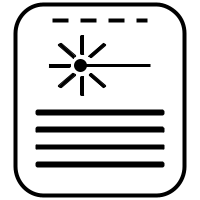
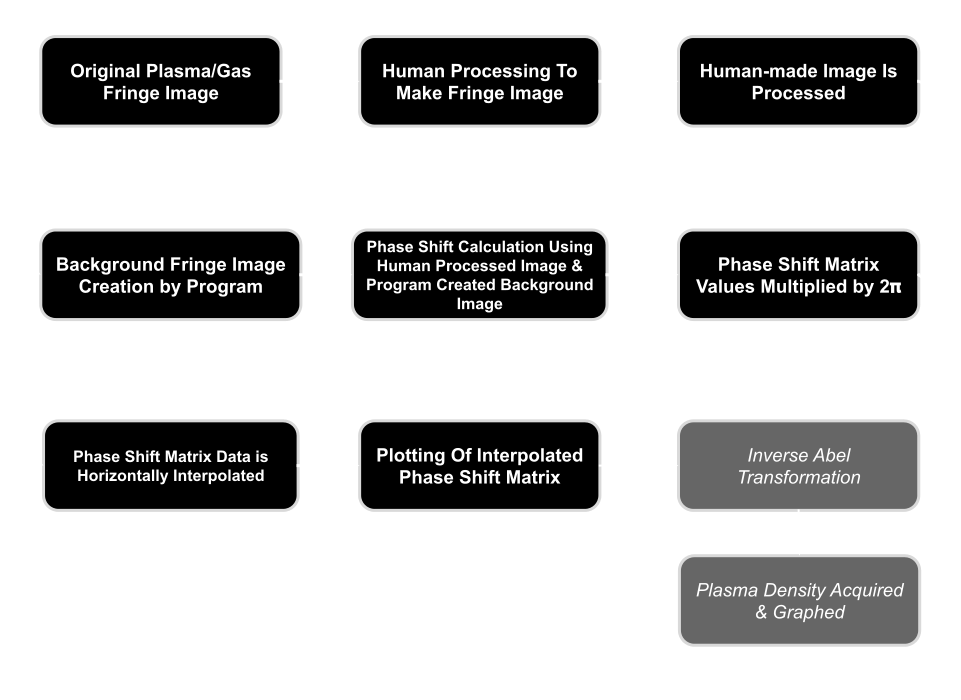
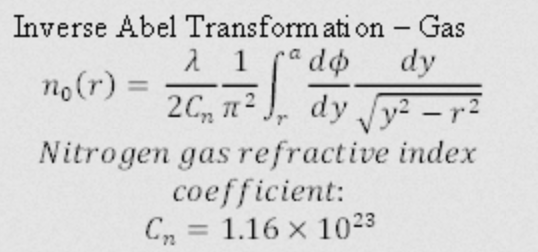
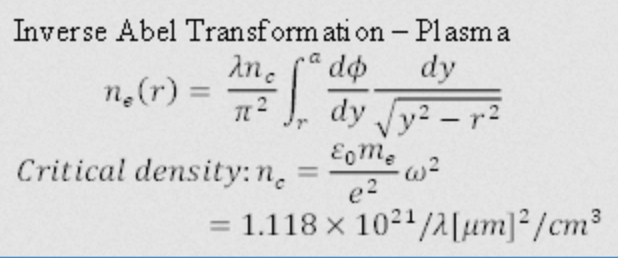

# Plasmainterferometry

 

 

__Author:__ Noah Klaus
 
__Credit:__ Lianxin Xin, her original codebase and instructions are the backbone of this project.
  
__Description:__ This project is a Python project whose purpose is to diagnose the density of plasma and gas using fringe intereference taken from lasers passing through the plasma or gas (gas should be generated from a gasjet).

 

# How To Use
For Gas, you should have your fringes oriented in a horizontal fashion such that the gasjet should be shooting in a direction perpendicular to your fringes. Ensure that your fringes are horizontal as possible to ensure the most precise measurement of density. After obtaining an image of your gasjet shooting, you should then rotate your image of the gas going through the fringes 90 degrees (direction does not matter as long as the resulting image has vertically oriented fringes).

For plasma, there is no unique image processing that needs to occur.

**Step 1:** Put your image of gas/plasma fringes into a photo editor of your choice and trace the fringe lines with lines of your own in a separate layer. Ensure that these lines are no more than 10px thick and only follow the inner portion of each fringe, you do not need to literally outline each fringe as that will not work with this program.

**Step 2:** Extract the lines you drew from the original image. Place those lines into another image whose background is white and ensure the lines themselves are black. Save this image as a 256 bit BMP or another BMP filetype that is solely greyscale. Keep in mind that all grey pixel will be deleted, only white and black pixels will remain after my program processes your image. Save this image onto your computer.

**Step 3:** Run main.py, and locate the aforementioned processed fringe image through the UI, and then specify what types of analysis graphs you would like to display.

**Step 4:** Depending on the type of interpolation you choose to employ (or is automatically employed), you will have to wait between 30 seconds and 5 mintues for the program to finish processing (Python is very slow).

**Step 5:** Enjoy the results.

 

# Flow
The way that my program works is shown below in the flowchart diagram

 

 
 
 

# Theory Equations
 

**Gas Density**
 

 

**Plasma Density**
 

 
