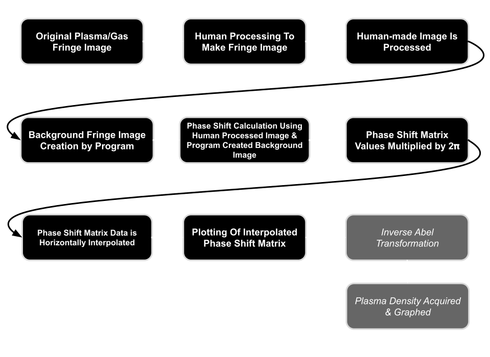
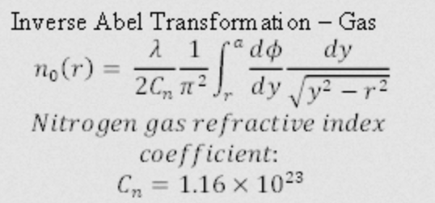

# Plasmainterferometry
__Author:__ Noah Klaus
 
__Credit:__ Lianxin Xin
  
__Description:__ This project is a Python project whose purpose is to diagnose the density of plasma using fringe intereference taken from lasers passing through the plasma.

 

# Flow
The way that my program works is shown below in the flowchart diagram

 

 
 
 

# Theory Equations
 
Gas Density

 
Plasma Density

 
